# Risk Attestation System — Data Model

> **Load when:** writing or modifying anything that touches the schema, migrations, ORM definitions, or entity relationships. **Required reading before adding any new entity.** Skip when working on UI-only logic or features that operate on already-modeled data.

## What this system is

A risk attestation platform for product teams. A Commercial Owner answers a set of nested, dependency-driven questions about a product. The system pre-populates answers by ingesting documents (PRDs, security whitepapers, marketing material) and the product's GitHub repository, with the LLM citing its sources and reporting confidence. Multiple downstream Reviewers (privacy, independence, brand, security, jurisdictional legal) evaluate the resulting attestation, each within their own domain. Patterns identify pre-approved product archetypes for fast-track approval. Discrepancies between owner-attested answers and system-inferred values are logged but the owner's answer is authoritative.

The body of evidence — attested answers + document extractions + repo findings + discrepancy log + threads — is created once and consumed by many reviewers.

## Schema (Mermaid ERD)

```mermaid
erDiagram
  PROJECT ||--o{ PROJECT_JURISDICTION : targets
  JURISDICTION ||--o{ PROJECT_JURISDICTION : scopes
  PROJECT ||--o{ ANSWER : has
  PROJECT ||--o{ DOCUMENT : ingests
  PROJECT ||--o{ REPO_FINDING : produces
  PROJECT ||--o{ DOC_EXTRACTION : produces
  PROJECT ||--o{ DISCREPANCY : surfaces
  PROJECT ||--o{ DELEGATION : contains
  PROJECT ||--o{ REVIEW : receives
  PROJECT ||--o{ PATTERN_MATCH : evaluates
  PROJECT ||--o{ SECTION_STATE : tracks
  QUESTION ||--o{ QUESTION_VERSION : versions
  QUESTION_VERSION ||--o{ ANSWER : answered_by
  QUESTION_VERSION ||--o{ QUESTION_DEPENDENCY : requires
  QUESTION_VERSION }o--|| SECTION : belongs_to
  SECTION ||--o{ SECTION_STATE : has_state_per_project
  ANSWER ||--o{ DELEGATION : delegated_via
  ANSWER ||--o{ DISCREPANCY : flags
  ANSWER ||--o{ THREAD : discusses
  PATTERN ||--o{ PATTERN_VERSION : versions
  PATTERN_VERSION ||--o{ PATTERN_MATCH : matched_by
  REVIEWER ||--o{ REVIEW : performs
  REVIEW ||--o{ THREAD : opens
  REVIEW ||--o{ CLARIFICATION : raises
  CLARIFICATION ||--o{ THREAD : has
  THREAD ||--o{ COMMENT : contains
  USER ||--o{ DELEGATION : assigns
  USER ||--o{ COMMENT : authors
  USER ||--o{ NOTIFICATION : receives
  POLICY_DOC ||--o{ POLICY_VERSION : versions
  PROJECT ||--o{ POLICY_SNAPSHOT : pins
  PROJECT {
    uuid id PK
    string name
    uuid commercial_owner_id FK
    enum status
    enum scope_type
    timestamp created_at
    timestamp submitted_at
  }
  SECTION {
    uuid id PK
    string slug
    string display_name
    int display_order
  }
  SECTION_STATE {
    uuid id PK
    uuid project_id FK
    uuid section_id FK
    enum state
    timestamp released_at
    timestamp cleared_at
  }
  QUESTION {
    uuid id PK
    string slug
    uuid section_id FK
    timestamp created_at
  }
  QUESTION_VERSION {
    uuid id PK
    uuid question_id FK
    int version
    text prompt
    enum answer_type
    json options
    timestamp published_at
    uuid published_by FK
  }
  QUESTION_DEPENDENCY {
    uuid parent_version_id FK
    uuid child_version_id FK
    json activation_rule
  }
  ANSWER {
    uuid id PK
    uuid project_id FK
    uuid question_version_id FK
    json value
    enum source
    float ai_confidence
    text citation
    uuid attested_by FK
    timestamp answered_at
    boolean in_clarification
  }
  DOCUMENT {
    uuid id PK
    uuid project_id FK
    string filename
    string uri
    string mime_type
    timestamp uploaded_at
  }
  DOC_EXTRACTION {
    uuid id PK
    uuid document_id FK
    text summary
    json extracted_facts
    timestamp extracted_at
  }
  REPO_FINDING {
    uuid id PK
    uuid project_id FK
    string repo_url
    string commit_sha
    string finding_type
    text evidence
    string file_path
    int line_number
    timestamp found_at
  }
  DISCREPANCY {
    uuid id PK
    uuid answer_id FK
    json owner_value
    json system_value
    text source_citation
    enum severity
    enum disposition
    timestamp logged_at
  }
  DELEGATION {
    uuid id PK
    uuid project_id FK
    enum scope_type
    json scope_target
    uuid assigner_id FK
    uuid assignee_id FK
    boolean delegate_authority
    enum status
    text message
    timestamp created_at
  }
  PATTERN {
    uuid id PK
    string name
    text description
  }
  PATTERN_VERSION {
    uuid id PK
    uuid pattern_id FK
    int version
    json criteria
    json jurisdiction_scope
    json reviewer_waivers
    timestamp published_at
  }
  PATTERN_MATCH {
    uuid id PK
    uuid project_id FK
    uuid pattern_version_id FK
    float fit_score
    json missing_criteria
    timestamp last_evaluated
  }
  REVIEW {
    uuid id PK
    uuid project_id FK
    uuid section_id FK
    uuid reviewer_id FK
    enum domain
    enum status
    enum disposition
    text disposition_notes
    timestamp opened_at
    timestamp closed_at
  }
  CLARIFICATION {
    uuid id PK
    uuid review_id FK
    uuid answer_id FK
    enum status
    timestamp opened_at
    timestamp resolved_at
  }
  REVIEWER {
    uuid id PK
    uuid user_id FK
    enum domain
    json jurisdictions
  }
  THREAD {
    uuid id PK
    uuid parent_id FK
    string parent_type
    enum status
  }
  COMMENT {
    uuid id PK
    uuid thread_id FK
    uuid author_id FK
    enum author_kind
    text body
    timestamp created_at
  }
  USER {
    uuid id PK
    string email
    string name
    json global_roles
  }
  JURISDICTION {
    uuid id PK
    string code
    string name
    enum tier
  }
  PROJECT_JURISDICTION {
    uuid project_id FK
    uuid jurisdiction_id FK
  }
  NOTIFICATION {
    uuid id PK
    uuid user_id FK
    uuid project_id FK
    enum type
    json digest_payload
    enum channel
    timestamp delivered_at
    timestamp read_at
  }
  POLICY_DOC {
    uuid id PK
    string title
    enum domain
    json jurisdiction_scope
  }
  POLICY_VERSION {
    uuid id PK
    uuid policy_doc_id FK
    int version
    text content
    timestamp effective_at
  }
  POLICY_SNAPSHOT {
    uuid id PK
    uuid project_id FK
    uuid policy_version_id FK
    timestamp pinned_at
  }
```

## Entity reference

### Project
The top-level container. One Commercial Owner, one or more target Jurisdictions. Status progresses through Drafting → Project Submission → Project Review → Project Disposition. The `scope_type` enum captures whether the deployment is single-country, multi-country, or global — distinct from the actual list of target jurisdictions, because "global" means something different for review routing than "all 157 countries individually selected."

### Section
A grouping of questions (Security, AI/ML, Data residency, Independence, Brand, Privacy). Sections are the unit of release — they can be Released to their scoped Reviewers independently of the rest of the project. Sections are global definitions; per-project state lives in `SECTION_STATE`.

### SectionState
Per-project, per-section state machine: Drafting → Released → Under Review → Cleared. A Clarification on a Cleared Section reverts that section's state to Under Review for the relevant Reviewer only. Carries timestamps for SLA tracking.

### Question and QuestionVersion
Question is the stable identity (slug like `data.classification.highest_tier`). QuestionVersion is the immutable published wording. Edits create a new QuestionVersion; Answers always point to a specific version so historical attestations remain coherent. New projects pick up the latest published version.

### QuestionDependency
The DAG. Each row says "child question becomes active when parent's answer satisfies `activation_rule`." Stored as JSON to keep the rule expressive without a separate rules engine. Foundational Questions are those with no incoming dependency rows.

### Answer
A specific Commercial Owner's response to a specific QuestionVersion on a specific Project. The `source` enum distinguishes `system_inferred` (AI pre-populated, awaiting review), `owner_attested` (Commercial Owner confirmed or edited), and `collaborator_supplied` (Section Lead or Question Collaborator answered). `ai_confidence` and `citation` are populated when the System pre-populated; they persist even after owner attestation for audit purposes. `attested_by` is the User ID of whoever last touched the answer; the Commercial Owner remains accountable regardless. `in_clarification` is a flag that flips true when a Reviewer-initiated Clarification temporarily makes the answer editable.

### Document and DocExtraction
Document is a file ingested into the project. DocExtraction is the LLM-produced structured summary plus extracted facts. Reviewers read DocExtractions, not raw Documents, by default. The summary is shown alongside the answers it influenced.

### RepoFinding
Objective fact about the codebase from static analysis or LLM inspection. Persists regardless of what the Commercial Owner answers. `commit_sha` pins the finding to a specific code state — re-scanning a later commit produces new findings without invalidating old ones.

### Discrepancy
A logged divergence between an owner-attested Answer and a system-inferred value. First-class entity because Reviewers query discrepancies as a unit of work. `severity` is computed from how far apart the values are and the question's risk weight. `disposition` is set by a Reviewer (acknowledged, warrants follow-up, no action).

### Delegation
An assignment of a Question or Section from one user to another. `scope_type` is `section` (Section Lead) or `question_set` (Question Collaborator). `delegate_authority` controls whether the assignee can themselves delegate further — true for Section Leads, false for Question Collaborators. `scope_target` is JSON: section ID for section scope, list of question IDs for question_set scope.

### Pattern, PatternVersion, PatternMatch
Pattern is a stable identity for a pre-approved archetype ("Read-only C1 data viewer"). PatternVersion is the immutable definition: criteria (which answer values qualify), jurisdiction scope (where the pre-approval applies), and reviewer waivers (which Reviewers' approvals are pre-granted on a match). PatternMatch is per-project: continuously recomputed as answers change, includes a fit score and missing criteria.

### Review
One Reviewer's evaluation of one Section of one Project. A submitted Section spawns N Reviews — one per applicable Reviewer based on the Section's domain and the Project's jurisdictions. Each Review has its own status, disposition, and threads. Cross-cutting reviews (Independence, Brand) attach to the project as a whole; the `section_id` may be null in those cases.

### Clarification
A Reviewer-initiated request that temporarily makes a specific Answer editable. Lives between a Review and an Answer. Has its own state (Open, Responded, Resolved) and its own Thread for back-and-forth. Multiple Clarifications can be open on one Review at one time.

### Reviewer
The reviewer's role record. Linked to a User, scoped to a domain (Privacy, Independence, Brand, Security, Jurisdictional) and one or more jurisdictions. A single human User can hold multiple Reviewer rows (a Privacy Reviewer for UK&I might also be the Privacy Reviewer for Ireland).

### Thread and Comment
Thread is polymorphic — `parent_type` is Answer, Review, Clarification, or Delegation. Comments live in Threads. `author_kind` distinguishes user-authored from system-authored (the AI explaining a discrepancy or citing a finding).

### User
The global identity. `global_roles` JSON captures system-wide permissions (e.g., is_question_author). Per-project roles are derived from relationships, not from this field.

### Jurisdiction
Country or region. `tier` enum captures regulatory-environment grouping (high-regulation, standard, low-data, etc.) used by Pattern criteria.

### Notification
The unit of delivery, batched. `digest_payload` JSON holds the rolled-up event list. `channel` indicates push/email/in-app. The notification engine reads pending events for a user+project+window and either appends to an open digest or creates a new one. The "50 emails" problem is solved at this layer — see Notification Strategy below.

### PolicyDoc and PolicyVersion
The underlying corpus the LLM uses during ingestion to figure out what answer the firm prefers. PolicyDoc is the stable identity (e.g., "EY Global Information Security Policy"); PolicyVersion is the immutable published content with an `effective_at` date.

### PolicySnapshot
At Project Submission, the system pins the current PolicyVersion of every relevant PolicyDoc to the project. This is what enables "as of submission, here's exactly which policy versions applied" — full audit reproducibility. Without this, retroactive policy updates would silently change what a past submission was evaluated against.

## Personas

**Commercial Owner** — Accountable individual for the attestation. Exactly one per project. Drafts the project, ensures questions are answered (personally or by delegation), reviews AI pre-populated answers and either accepts or edits, responds to reviewer Clarifications, and ultimately attests to the truthfulness of all answers.

**Collaborator** — Umbrella term for a subject-matter contributor invited to answer questions. Has intimate knowledge of one slice of the product but is not accountable for the overall attestation. Two authorization levels:

- **Section Lead** — Authority over an entire section. Can answer any question in the section, can delegate individual questions to Question Collaborators, can mark the section ready for Section Release. One per section maximum per project.
- **Question Collaborator** — Authority over one or more specific questions, not a whole section. Can answer and comment. Cannot further delegate. Cannot mark sections ready.

**Reviewer** — Risk-domain expert who evaluates a Released Section or Submitted Project. Five types:

- **Jurisdictional Reviewer** — Legal/risk expert scoped to a specific country or region.
- **Independence Reviewer** — Firm-wide expert on EY's independence rules.
- **Privacy Reviewer** — Data protection expert (C1/C2/C3/C4 classification, residency, retention, subject rights).
- **Brand Reviewer** — Reputational risk: naming, marketing, positioning.
- **Security Reviewer** — Technical security controls vs. data sensitivity. Reads both attested answers and Repo Findings.

**Policy Author** — Legal/risk/independence professional who maintains the question corpus, policy documents, dependency graph, Patterns, and per-question "more info" snippets. Distinct workflow from Reviewer. The underlying global-role flag is retained as `is_question_author` for schema continuity.

**System** — The AI-driven actor. Pre-populates answers, generates DocExtractions, produces RepoFindings, computes PatternMatches, flags Discrepancies. Never accountable; outputs are accepted by humans or persist as objective evidence.

A single human User can hold different personas across different projects.

## Process terms

**Drafting** — Commercial Owner and Collaborators are working on answers. No Reviewer visibility yet.

**Section Release** — A section is locked from project-team editing and made visible to its scoped Reviewers. Multiple sections can be released independently.

**Project Submission** — Full project locked, all Reviewers (including cross-cutting) can begin. Triggers fast-track vs. standard track determination.

**Section Review** — A Reviewer's active evaluation of a Released Section.

**Project Review** — Aggregate state. The project is "in Review" once any Section Review is active.

**Clarification** — Reviewer-initiated thread that temporarily makes a specific Answer editable. States: Open, Responded, Resolved.

**Disposition** — A Reviewer's outcome (approve, conditional, reject), issued once they have no open Clarifications.

**Project Disposition** — Aggregate outcome: Approved (all approve), Conditionally Approved (at least one conditional, none reject), Rejected (any reject), Pending (any open).

**Cleared** — Per-section state once every applicable Reviewer has issued an approving or conditional Disposition.

**Body of evidence** — The full set: attested answers + DocExtractions + RepoFindings + Discrepancy log + Threads.

**Fast-track** — Expedited path when a PatternMatch achieves full fit. Specific Reviewers may auto-approve via Pattern's `reviewer_waivers`.

**Standard track** — Default path. All applicable Reviewers must issue Dispositions.

## Notification strategy

Notifications batch on a per-recipient, per-project, time-windowed basis. The Notification entity holds a `digest_payload` rather than individual events. When a new event fires (delegation assigned, comment posted, Clarification opened), the notification engine:

1. Looks for an open (un-delivered) Notification for that user+project within the active digest window.
2. If found, appends the event to its `digest_payload`.
3. If not, creates a new Notification with the digest window's expiration.
4. At window expiration, the Notification is delivered through the user's preferred channel.

Override: events flagged urgent (Reviewer Disposition issued, Project rejected) deliver immediately and do not batch.

User preferences (digest cadence, channel, urgent-override rules) are stored separately in a `NotificationPreference` table not yet modeled here.

## Open questions and design decisions to revisit

The following are deliberately unresolved. **Do not invent answers without confirming with the team first.**

1. **Recursive collaboration depth.** A Section Lead can delegate to Question Collaborators. Can a Question Collaborator delegate further? Currently `delegate_authority` is false for Question Collaborators, but this may need to change for genuinely deep technical questions.

2. **Policy retroactivity.** PolicySnapshot pins versions at Project Submission. But what about projects in Drafting when a policy updates? Do they continue against the old version, switch to new, or get a notification with a choice? Currently unmodeled.

3. **Clarification on a Cleared Section.** When a Clarification reopens an Answer in an already-Cleared section, does the SectionState revert to Under Review for all Reviewers, or only the Reviewer who raised the Clarification? Current model is ambiguous; recommendation is "only the relevant Reviewer."

4. **Pattern slug stability assumption.** PatternVersion criteria reference questions by slug, not version ID. This assumes question slugs preserve meaning across versions. If a question's meaning materially changes, the pattern must be re-versioned — but the system has no automatic check for this.

5. **Per-project explicit roles vs. derived.** Currently Commercial Owner is a column on Project; Collaborators are derived from Delegations; Reviewers are derived from Reviews. No `ProjectMembership` table. May need one if read-only access or co-ownership is required.

6. **NotificationPreference.** Per-user settings (digest cadence, channels, urgency overrides) are referenced in the strategy section but not modeled. Easy to add; deferred until UX is firmed up.

7. **GitHub re-scan policy.** RepoFinding has `commit_sha` to pin findings to a code state. But the project's "current findings" view needs a rule: latest commit only? Diff against last submission? All findings ever? Not yet decided.

8. **Cross-cutting Reviews and section_id null.** Independence and Brand reviews attach to the project, not a section, so `section_id` is nullable in REVIEW. This creates a slight asymmetry — confirm this is fine vs. introducing a synthetic "whole project" Section.

## Conventions for Claude Code

When extending this schema:

- **Versioned entities** (Question, Pattern, PolicyDoc) follow the same pattern: stable identity row + immutable version rows + a join from project-scoped data to a specific version. Don't introduce new versioning patterns.
- **Polymorphic associations** (Thread.parent_type) are used sparingly and only where the children genuinely behave the same way. Don't introduce new ones without discussion.
- **JSON columns** are used for genuinely variable structure (activation_rule, scope_target, digest_payload, criteria). Don't use JSON to dodge schema design when a real table would do.
- **Soft deletes are not in this model.** If a Project, Answer, or anything else needs to be removed, the audit trail concern means that's a design decision, not a column we add automatically.
- **Naming**: snake_case for columns, PascalCase for entities in prose, ALLCAPS in the Mermaid source per Mermaid convention.
